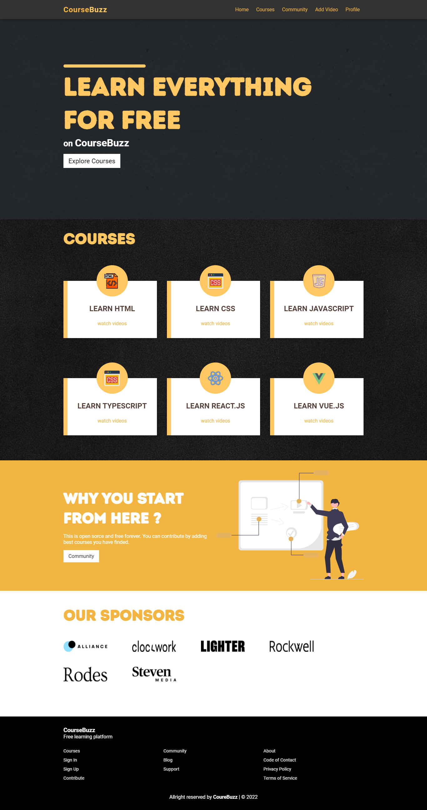
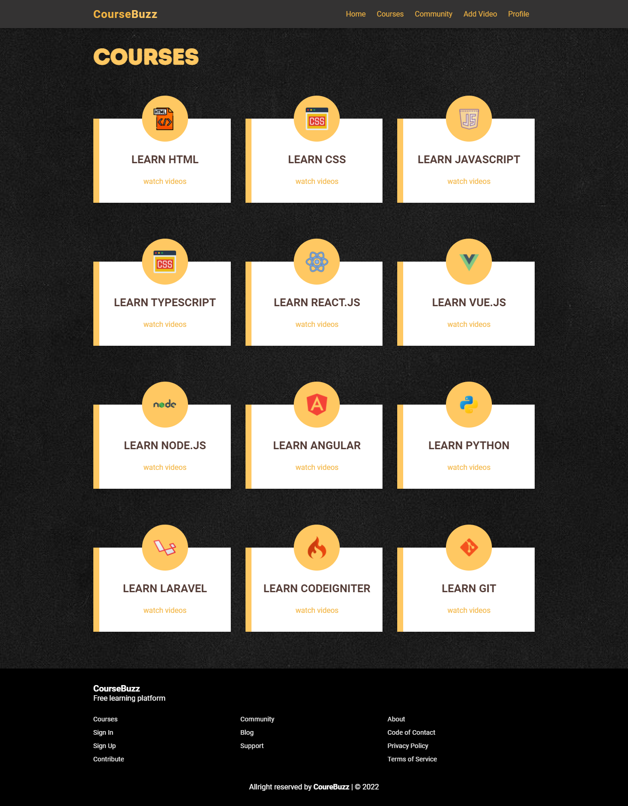

# This is a fullstack web application for managing course

[Live 🔥](https://course-buzz.herokuapp.com/)

|     Home page      |    Courses page    |
| :----------------: | :----------------: |
|  |  |

I have built this website for my favourite youtube videos those are almost like paid courses. In this website users can create account, login to existing account and add their favourite videos. User also can leave questions, on the community 😍 because in the community page an amazing fatures you can find. Users can leave their questions and reply to existing questions as well.

I have used `expressjs` for backend, `mongodb`, `jwt` for data base and authentiaction and `react` with `context api` for handling data on the front and Hdid not use any css frameworks. All styles are hand-written ✍🏼.

## to run this app 👇🏼

- run this command from the root of the directory to install all required packages: `npm install && cd client && npm install`
- now, add an `.env` file in the root with this data 👇🏼
  - MONGODB_URI: `your mongodb uri`
  - JWT_SECRET: `ANYSECRET`
  - JWT_EXPIRE: `7d`
- Now run the app 🔥 : `npm run app` It will run both of your front and back concurrently
